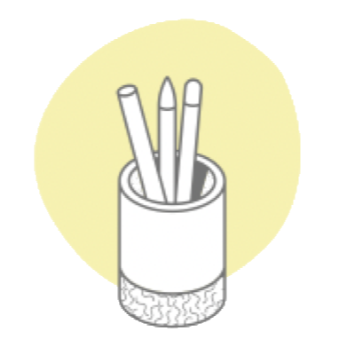
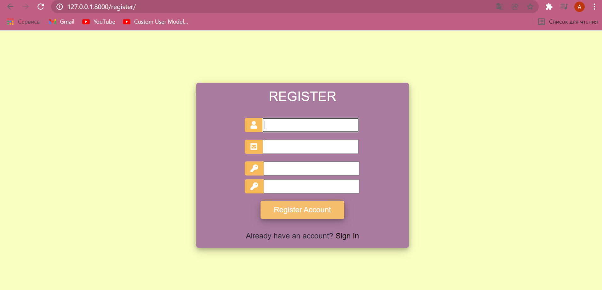
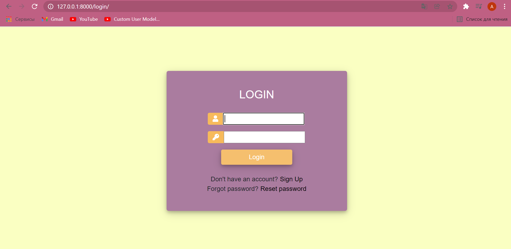
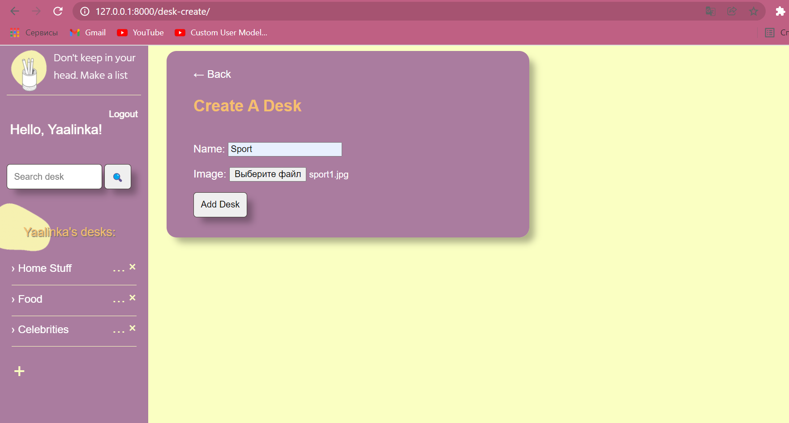
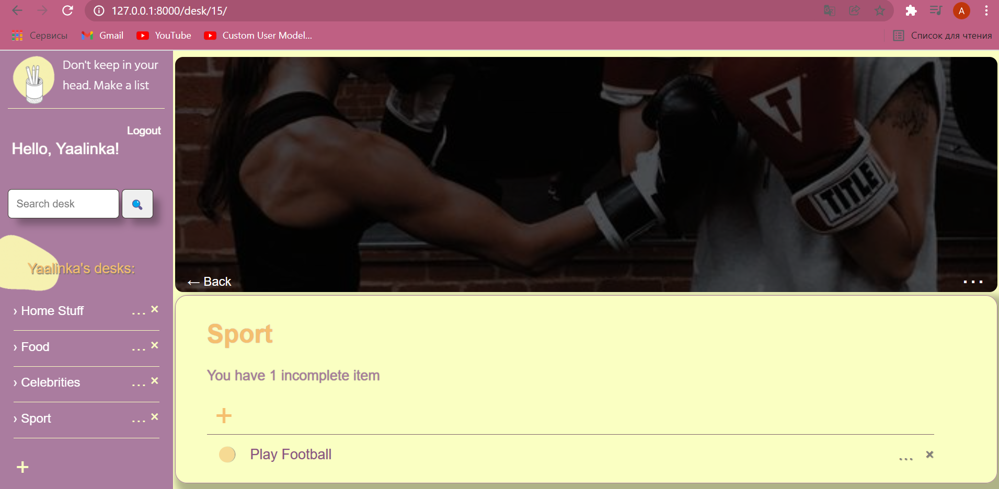
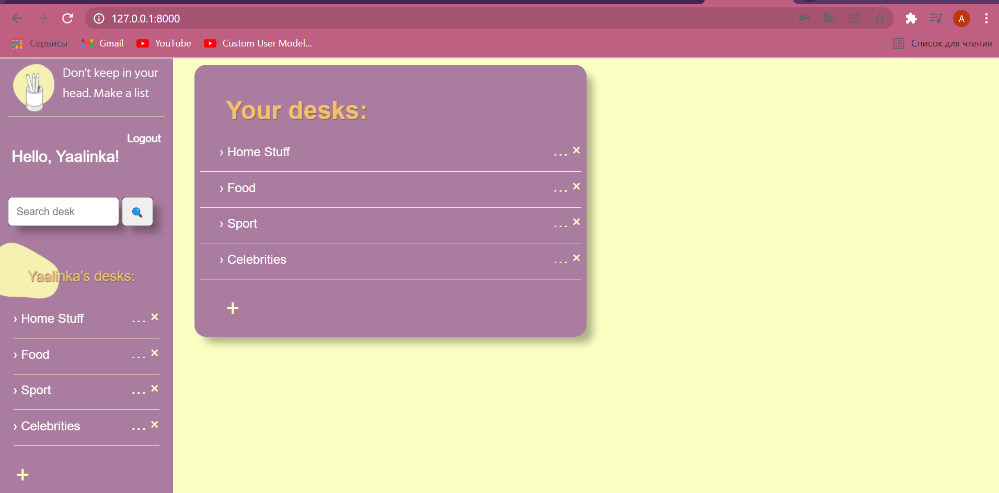

# ToDoList - site with custom desks to keep a to-do list

### Don't keep in your head. Make a list

## Description
It's a site with register and log-in systems. There you can create desks with your own pictures and make lists. I've learned web development myself without any course or coaching so don't expect too much from the source code xD.

- Register and Log-in systems. If forgot password could reset and change it.

- Create, Update desks customized with your own picture

- Add, Edit, Mark as complete/uncompleted, Delete tasks (items) from your desk

- Main page only with your own desks

## Technologies 
- Python3
- Django3
  * Class based views 
  * Django Mixins 
  * Django decorator login_required 
  * Django filter 
  * Email send 
- HTML, CSS

